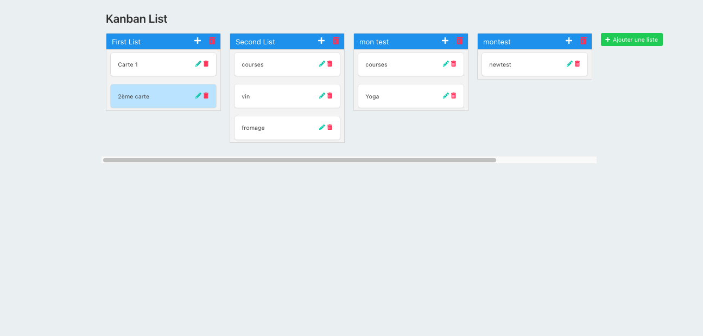

# :inbox_tray: Kanban Front 

## Create a Kanban type application where it is possible to create cards within lists.

## Illustration

## Language
- html5
- css3
- javascript vanilla

## Goals 
- Fundamentals (Javascript)
- DOM & interface
- Drag & Drop
- Interact with the API (Fetch)

## Status
Project not completed

## Context
Project carried out during my studies as a web developer